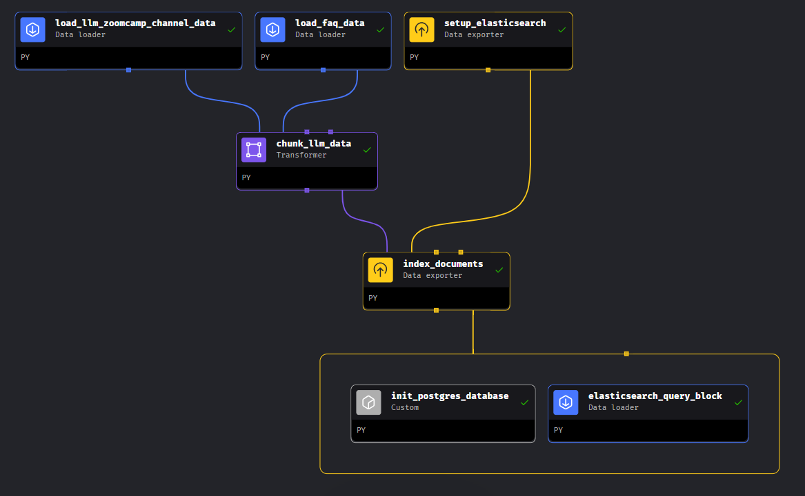
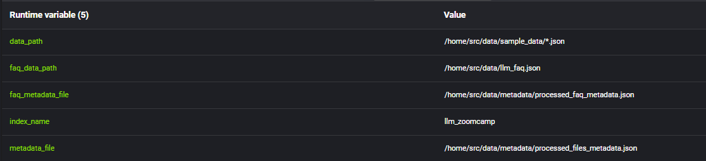
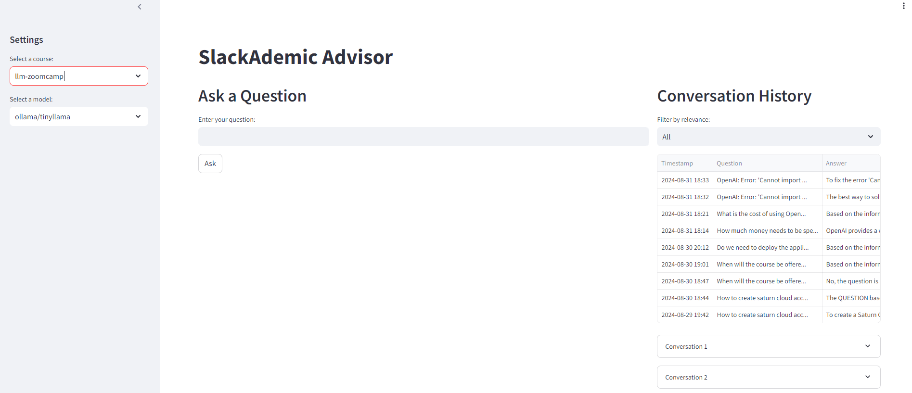
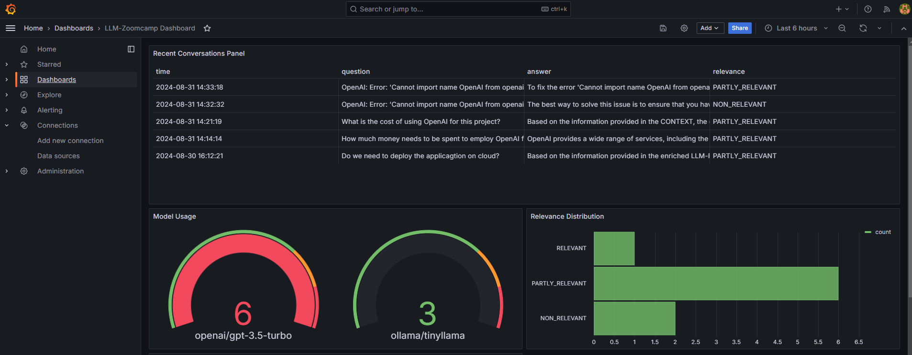

# SlackademicAdvisor-RAG

## Index

1. [Problem Statement](#problem-statement)
2. [About](#about)
3. [Features](#features)
4. [Technologies](#technologies)
5. [Project Structure](#project-structure)
6. [Reproducibility](#reproducibility)
7. [Conclusion](#conclusion)

---

## Problem Statement

The **SlackademicAdvisor-RAG** project aims to solve the problem of efficiently answering student queries by combining FAQ data from the LLM-Zoomcamp course repository and daily discussions from a dedicated Slack channel. This ensures that students have access to a comprehensive and up-to-date knowledge base, helping them find answers quickly and reducing the need for repetitive questions.

## About

**SlackademicAdvisor-RAG** is designed to streamline the onboarding process for students taking the LLM-Zoomcamp course. The LLM-Zoomcamp course repository includes a dedicated FAQ section with numerous subsections per module to address questions, alongside a vibrant Slack channel where daily discussions and queries take place. **SlackademicAdvisor-RAG** leverages these two data sources—FAQ and Slack channel data—to create a vector document that serves as a comprehensive base/ground-truth for answering any questions that new or existing students might have.

## Features

- Integration of FAQ data from the LLM-Zoomcamp course repository.
- Collection of questions and discussions from the Slack channel.
- Creation of a vector document for efficient question-answering.
- Retrieval-Augmented Generation (RAG) to provide accurate responses to student queries.
- Monthly updates and indexing of new data based on DataTalks Club #slack-dump.

## Technologies

- **LLM**: 
  - "ollama/tinyllama"
  - "openai/gpt-3.5-turbo"
  - "openai/gpt-4o-mini"
  
- **Knowledge Base**: 
  - Elasticsearch
  
- **Monitoring**: 
  - Grafana
  
- **Interface**: 
  - Streamlit
  
- **Ingestion Pipeline**: 
  - Mage-ai

## Project Structure

### Pipeline Blocks

The project uses **Mage-ai** for orchestrating the pipeline blocks

1. **Load_llm_zoomcamp_channel_data**:
   - Reads LLM-Zoomcamp channel data from the Slack dump folder specified in the `data_path` pipeline variable. 
   - On refresh, it checks for new files in the data path and reads them.

2. **Load_faq_data**:
   - Reads LLM-Zoomcamp FAQ data from DataTalks Club’s GitHub repository, specified in the `faq_data_path` pipeline variable.
   - On refresh, it checks for new entries in the FAQ data path and reads them.

3. **Chunk_llm_data**:
   - Receives data from the LLM-Zoomcamp channel and FAQ document, chunking the relevant fields (course, question, and answer) into a `chunk` column.

4. **Setup_elasticsearch**:
   - Initializes the Elasticsearch index.

5. **Index_documents**:
   - Reads the chunk data and Elasticsearch status before indexing the combined chunked documents into the LLM-Zoomcamp index set up in the `Setup_elasticsearch` block.

6. **Init_postgres_database**:
   - Initializes the PostgreSQL database with the table `conversations` and the required schema if it doesn’t exist. 
   - Captures the search conversations used to query the LLM-Zoomcamp Elasticsearch database.

7. **Elasticsearch_query_block**:
   - Tests Elasticsearch by querying the index storing the relevant information.

### Streamlit Interface

The project includes a **Streamlit** interface for the application:

- **Sidebar (Settings)**: 
  - Contains course and model selection options for user queries.
  
- **Ask a Question**:
  - Accepts user queries and runs them against a RAG flow. 
  - Queries the knowledge base, builds the prompt, and sends it to the user-selected LLM.
  - Supports "ollama/tinyllama", "openai/gpt-3.5-turbo", and "openai/gpt-4o-mini" models.
  - Returns the answer to the UI along with details like Response time, Model Used, Associated Cost, and Total Tokens used.
  - Stores this information in the PostgreSQL `conversations` table set up with the pipeline execution.

- **Conversation History**:
  - Displays the latest search history for the last 10 conversations.
  - Expander for each conversation includes details like Question, Answer, Relevance, Model, and Timestamp.

### Monitoring with Grafana

For monitoring, the project uses **Grafana**:

- **Grafana** is dependent on the PostgreSQL `conversations` table.
- Creates a dashboard with panels for:
  - **Response Time**
  - **Relevance Distribution**
  - **Model Usage**
  - **Token Usage**
  - **OpenAI Cost**
  - **Recent Conversations**

## Reproducibility

Clear instructions and paths to all required datasets and code are provided to ensure that the project can be easily reproduced and evaluated.

## Conclusion

**SlackademicAdvisor-RAG** is an end-to-end RAG application that effectively combines Slack discussions and FAQ data to create a powerful and responsive system for assisting LLM-Zoomcamp students. The project is thoroughly evaluated, well-documented, and deployable, making it a valuable tool for both students and educators.
